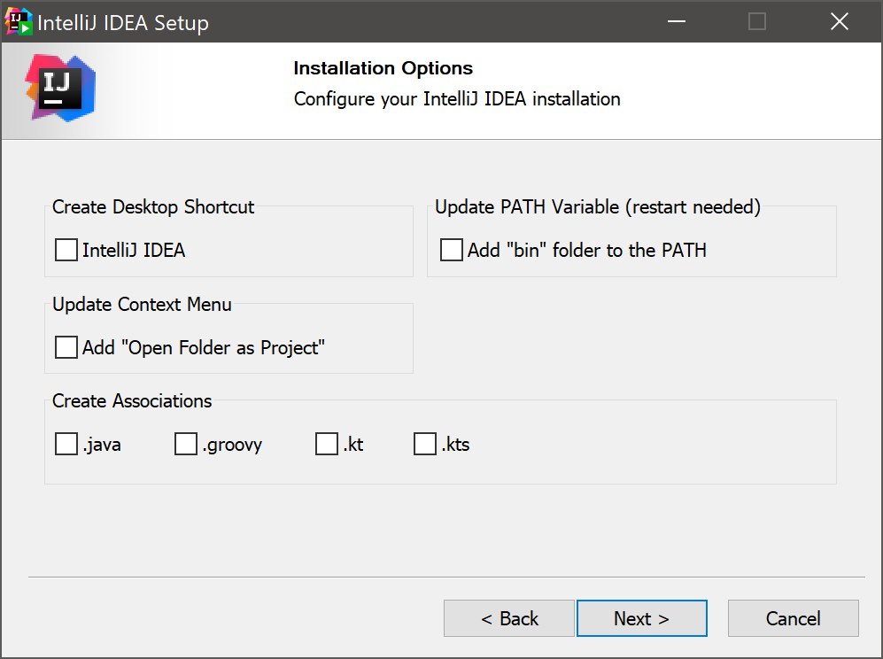

# Introdução: Instalar o intellij

## Baixando o IntelliJ para Projetos Java

Neste tutorial, vamos aprender como baixar o IntelliJ Ultimate ou Community Edition para desenvolver projetos Java.

### Passo 1: Acessar o site do IntelliJ

Primeiro, acesse o site oficial do IntelliJ em [https://www.jetbrains.com/pt-br/idea/](https://www.jetbrains.com/pt-br/idea/)
ou pelo toolbox [https://www.jetbrains.com/toolbox-app/](https://www.jetbrains.com/toolbox-app/), recomende-se pelo toolbox para facilitar instalação !

### Passo 2: Escolher a edição

Na página inicial do site, você encontrará as opções para baixar o IntelliJ Ultimate e o IntelliJ Community Edition. Escolha a edição que melhor atenda às suas necessidades e clique no respectivo botão de download.

### Passo 3: Executar o instalador

Após o download, execute o instalador do IntelliJ. Siga as instruções do assistente de instalação para concluir o processo.
selecione todas as opções

### Passo 4: Configurar o IntelliJ

Após a instalação, abra o IntelliJ e siga as etapas de configuração inicial, como a seleção do tema, plugins e configurações de idioma.

### Passo 5: Começar a desenvolver

Agora você está pronto para começar a desenvolver projetos Java no IntelliJ. Explore os recursos e ferramentas disponíveis para tornar sua experiência de programação mais produtiva.

<seealso>
    <category ref="wrs">
     <a href="https://www.jetbrains.com/idea/download/?section=mac">Site oficial do IntelliJ</a>
     <a href="https://www.jetbrains.com/help/idea/installation-guide.html">Como instalar o intellij</a>
    </category>
</seealso>
